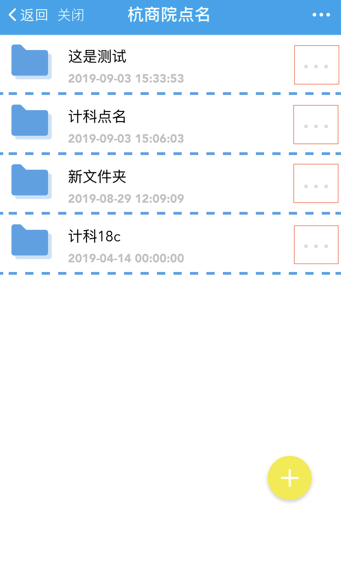

# 统计数据导出

## 具体步骤
1. 点击下图红框位置

 

2. 选择**[统计信息]**

## 缺勤统计
1. 如下图

2. 点击红框附近可以显示改学生所有的缺勤信息

## 缺勤比例
1. 如下图

## 统计下载

> 统计用于将部分或者所有的缺勤信息导出为excle文件。方便进行汇总和查看！

1. 如下图

2. 点击红框可以设置导出日期限制(如果不设置，默认为所有！)

3. 点击下载导出

> 由于易班平台的限制导入请复制下载链接到电脑浏览器打开，将会自动下载一个excle文件。

4. 下载文件

5. 打开excle

